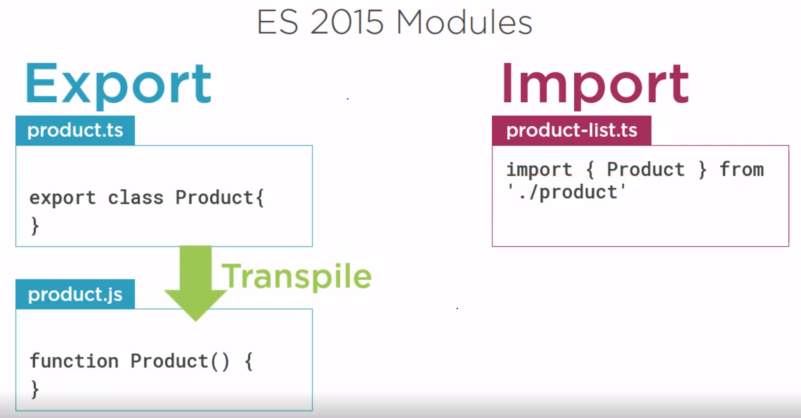
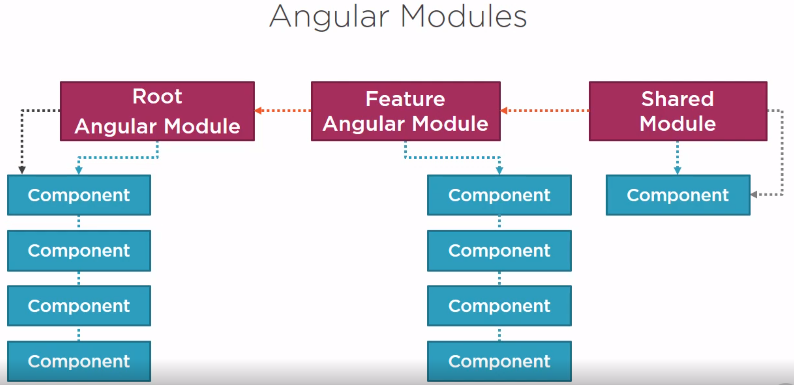

APM
===

This project was generated with [Angular
CLI](https://github.com/angular/angular-cli) version 8.1.2.

Development server
------------------

Run `ng serve` for a dev server. Navigate to `http://localhost:4200/`. The app
will automatically reload if you change any of the source files.

Code scaffolding
----------------

Run `ng generate component component-name` to generate a new component. You can
also use `ng generate directive|pipe|service|class|guard|interface|enum|module`.

Build
-----

Run `ng build` to build the project. The build artifacts will be stored in the
`dist/` directory. Use the `--prod` flag for a production build.

Running unit tests
------------------

Run `ng test` to execute the unit tests via
[Karma](https://karma-runner.github.io).

Running end-to-end tests
------------------------

Run `ng e2e` to execute the end-to-end tests via
[Protractor](http://www.protractortest.org/).

Further help
------------

To get more help on the Angular CLI use `ng help` or go check out the [Angular
CLI README](https://github.com/angular/angular-cli/blob/master/README.md).

01-Introduction
---------------

**Anatomy of an Angular Application**

In Angular, an application is comprised of a set of components and services that
provide functionality across those components. So, what is an Angular component?
Each component is comprised of a template, which is the HTML for the user
interface fragment defining a view for the application. Add to that a class for
the code associated with the view. The class contains the properties or data
elements available for use in the view, and methods which perform actions for
the view such as responding to a button click. A component also has metadata,
which provides additional information about the component to Angular. It is this
metadata that identifies the class as an Angular component. *So a component is a
view defined with a template, its associated code defined with a class, and
additional information defined with metadata.* As we build these components, how
do we pull them together into an application? We define Angular modules.
*Angular modules help us organize our application into cohesive blocks of
functionality. Every Angular application has at least one Angular module called
the application's root Angular module*. An application can have any number of
additional Angular modules, including feature modules that consolidate the
components for a specific application feature.

**About Modules**

With JavaScript, there's always the problem of namespaces. If we are not
careful, we can easily end up with variables or functions in the global
namespace. In addition, JavaScript didn't provide features to help with code
organization. Modules help resolve these issues. AngularJS has modules to help
us organize our code and resolve some name spacing issues. TypeScript also has
modules that help keep things out of the global namespace. ES2015 set a standard
for defining a module. In ES2015, a module is a file, and a file is a module. So
when coding in ES2015, we don't need to define or name modules. Just create a
file, write some code, export or import something, and bang, the file becomes a
module. Angular leverages ES2015 modules, so as we create code files and import
or export something, we create the modules for our application. But wait,
there's more. Angular also has Angular modules. Angular modules are separate and
different from Angular's implementation of ES2015 modules. Let's look first at
how Angular makes use of ES2015 modules. Then we'll introduce Angular modules.
How do ES2015 modules work? Say we create a code file called product.ts and
export a class named Product from that file. This file then becomes a module.
Because the class is exported, we can use that class in any other module by
importing it. So here we have a file called product- list.ts and we import our
product class. This file also becomes a module because we imported something.
Notice the syntax here. In curly braces, we define the name we want to import,
in this case Product, and we define the file we want to import it from. Here we
want to import from product.js. Wait, what? The product class is in product.ts,
but when we compile, the TypeScript file is transpiled into an ES5 JavaScript
file. So at run time, we are importing from the .js file. But notice that we
don't list the extension here anyway.

Now let's look at Angular modules. Angular modules help organize an application
into cohesive blocks of functionality. Every Angular application has at least
one Angular module, by convention called AppModule. As an application gets more
features, we can group those features into their own feature modules. We can
even define shared or common modules for code used by multiple Angular modules.
This keeps the code organized and provides a cohesive unit we can load on start,
or lazy load as it is needed. In each Angular module we declare the set of
components and other code files associated with the module and the dependencies
needed by those components. Each component we create is declared in and belongs
to one, and only one, Angular module.

Let's clarify the difference between ES2015 modules and Angular modules. ES
modules are code files that import or export something. Angular modules are code
files that organize the application into cohesive blocks of functionality. ES
modules organize our code files. Angular modules organize our application. ES
modules modularize our code. Angular modules modularize our application. ES
modules promote code reuse. Angular modules promote boundaries within our
application. So ES modules are about code files and Angular modules are about
our application. To keep these terms straight, I'll refer to the ES2015 modules
as ES modules and Angular modules as Angular modules.
